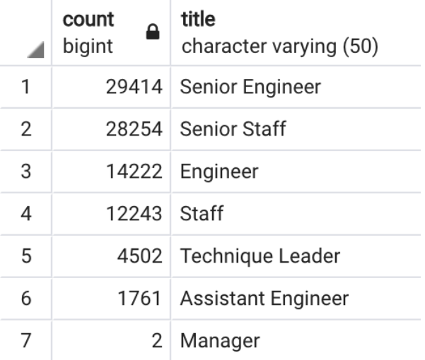

# Pewlett Hackard Silver Tsunami Analysis

## Purpose
This analysis will aid Pewlett Hackard prepare the transition as the elgible for retirement employees take their leave, and how best to bridge the void. 

## Analysis

This analysis will help mitigate the potential loss of nearly 40% of seasoned workforce. 

We have created a breakdown of retiring employees by their title, so the management team can anticipate where there will be the greatest vancancies. 
    
Here are the breakdown by job title that may become vancancies. 
- There are 90,398 employees who will soon be elgible to retire out of 240,124 total employees. 
- The current mentorship eligibilty list from employees born in 1965 is 1500. 
- One way to increase mentors is to open the elgibility to additional birth years
- Engineering will be most affected by the silver tsunami.

This will not provide adequate mentor-mentee ratio for the potential need. To increase the number of mentors, we could re-evaluate the criteria to become a mentor. We could open the age range to those born outside of 1965. For example, with the same criteria as the previous mentorship eligibility as those born in 1965, there are over 18,000 born in 1964, and another 18,000 born in 1963. As we know, there is more to being a mentor than being of a certain age. 

Another possibility is to recruit from within the nearly 8,600 senior engineer to mentor assistant engineers, engineers and up and coming senior engineers. This will dramatically increase the potential mentorship elgibility list and provide a more appropriate ratio.

Similar strategy can also be applied to the staff mentorship elgiblity. There are more than 82,000 senior staff, and nearly 40,000 retirement elgible senior staff and staff. In this depatment with this strategy, there could potentially be a surplus of mentors. 

## Summary
There is a potential retiring population of 40% of the entire Pewlett Hackard workforce. The greatest need will be in the engineering department. One way to mitigate the silver tsunami is to institude a mentorship program. There are 1500 employees born in 1965 who are elgible for retirement and met the metorhship elgibility criteria. Fifteen hundred employees are insufficient to mentor the next generation of employees. However, based on additional queries we know there are 18,000 employees born in 1964 and an additional 18,000 employees born in 1963 who meet the same criteria as those deemed elgible for mentorship born in 1965. 

The qualifications of mentorship is more complex than birth year and this is worthy of additional exploration. On the same token, another avenue of exploration could be senior engineer, retirment eligible or not, be considered for the mentorship program. Since the engineering need is the most dire, we could tap into the current 8,600 senior engineers to mentor the next generation of Pewlett Hackard engineers. 

